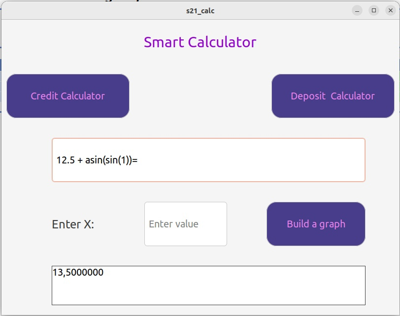
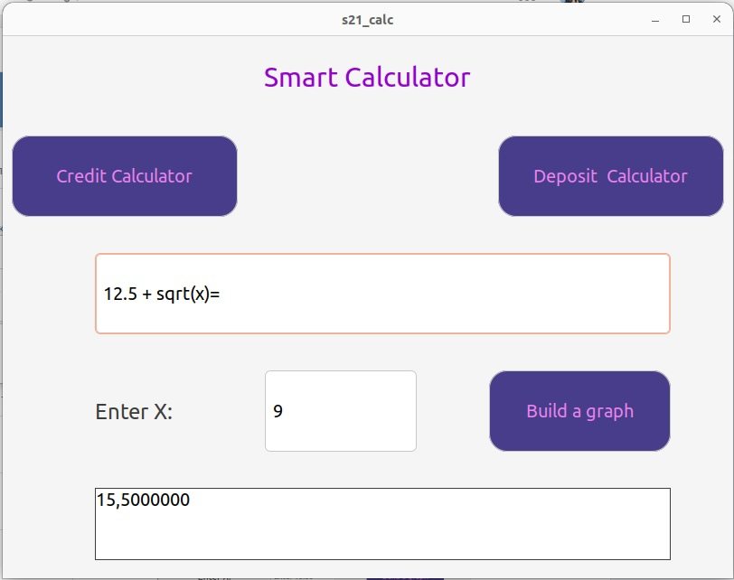
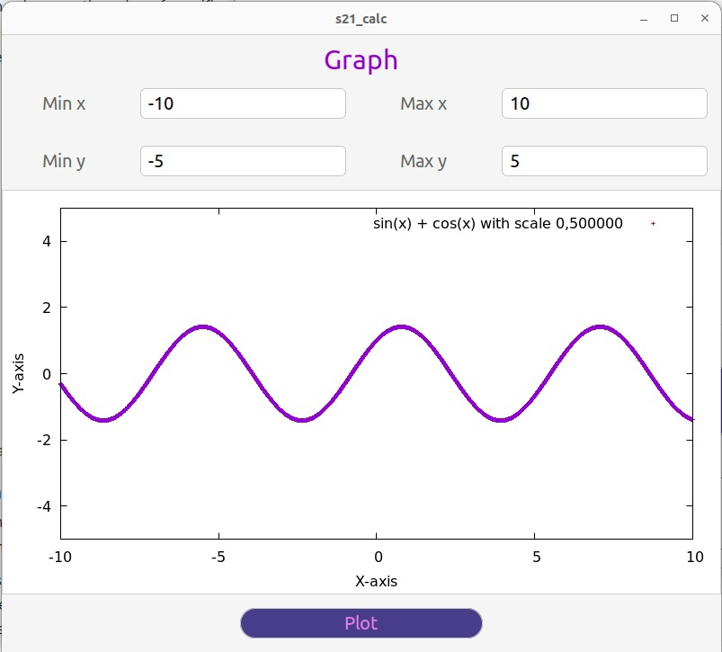
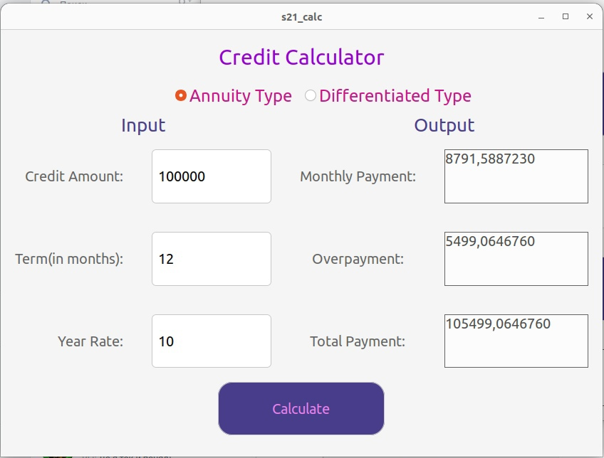

# SmartCalc - Программа калькулятор

Калькулятор SmartCalc - написанный на С++ калькулятор с поддержкой построения графиков и содержащая кредитный калькулятор. Интерфейс программы реализован при помощи фреймворка GTKMM3. В проекте использован паттерн MVC для отделения бизнес-логики от кода представлений. Калькулятор поддерживает вычисление выражений, подстановку x и вычисление выражений с заданным x, а так же построение графика заданного выражения с задаваемыми областями значений и определений и количеством точек.

Программа способна работать с выражениями, содержащими следующие операторы и функции:

- **Арифметические операторы**:

| Название оператора | Инфиксная нотация   (Классическая) | Префиксная нотация   (Польская нотация) |  Постфиксная нотация   (Обратная польская нотация) |
| ------ | ------ | ------ | ------ |
| Скобки | (a + b) | (+ a b) | a b + |
| Сложение | a + b | + a b | a b + |
| Вычитание | a - b | - a b | a b - |
| Умножение | a * b | * a b | a b * |
| Деление | a / b | / a b | a b \ |
| Возведение в степень | a ^ b | ^ a b | a b ^ |
| Остаток от деления | a mod b | mod a b | a b mod |
| Унарный плюс | +a | +a | a+ |
| Унарный минус | -a | -a | a- |

- **Функции**:

| Описание функции | Функция |   
| ---------------- | ------- |  
| Вычисляет косинус | cos(x) |   
| Вычисляет синус | sin(x) |  
| Вычисляет тангенс | tan(x) |  
| Вычисляет арккосинус | acos(x) | 
| Вычисляет арксинус | asin(x) | 
| Вычисляет арктангенс | atan(x) |
| Вычисляет квадратный корень | sqrt(x) |
| Вычисляет натуральный логарифм | ln(x) | 
| Вычисляет десятичный логарифм | log(x) |

- **Кредитный калькулятор**:
    - Вход: общая сумма кредита, срок, процентная ставка, тип (аннуитетный, дифференцированный)
    - Выход: ежемесячный платеж, переплата по кредиту, общая выплата

## Интерфейс:

- Вычисление выражения:

- Вычисление выражения с подстановкой x:

- Построение графика функции:

- Использование кредитного калькулятора

